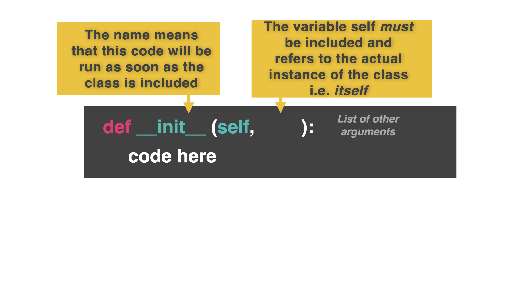

# OOP

Object Oriented Programming (OOP) is a **programming paradigm** (a way of thinking about how to solve a problem) that is based on **classes** and **objects**, which store all of their data and behaviors inside them.

You can think of a class like a cookie cutter, or template. It has pre-defined characteristics (shape, size etc).

Objects are like the cookies created using the cutter. They all get the same size and shape, but then we can personalize each one (sprinkles, icing, etc).

Some programming languages, like Java, are entirely based on OOP. So all you Java coders will be used to this way of thinking.  

If you're a Python programmer, then this may take some getting used to, but stay with it.

This approach lets us create a template for something like an enemy in a video game, and then use that template to create, say, 20 enemies. Instead of having to code each one individually.  

It's very powerful for large scale projects, but we're going to start small.

## Classes

👉 Let's create a *template*, known as a **class**.  Our theme is animals.  Our class will contain all the characteristics (think variables) that animals have in common.  

Remember that this is just a template. All the characteristics are set to 'None' in the template and we will customize these values when we use the template to create (*instantiate*) each animal.  The values will be passed as arguments into the `__init__` subroutine inside each animal object.

We also want to create a subroutine called *init* (short for initialisation) which tells the class what to do when it is used to create each instance of an animal.



```python
class animal:
  species = None
  name = None
  sound = None
  # Sets the characteristics

  def __init__(self, name, species, sound):
    self.name = name
    self.species = species
    self.sound = sound
  # 'self' means 'this object'
  # This code sets the name, species and sound of each object to the arguments passed in when it is created (instantiated).
```

## Instantiation


Instantiation means 'use the template to create an object'. Like pressing the cutter into the dough to make a cookie.

👉 Let's instantiate a dog object.


```python
class animal:
  species = None
  name = None
  sound = None
  # Sets the characteristics

  def __init__(self, name, species, sound):
    self.name = name
    self.species = species
    self.sound = sound

##### THE NEW BIT #######

dog = animal("Brian", "Canine", "Woof") # Use the animal class to create a new object called 'dog' with the following parameters.
```

👉 Now let's output the dog's name.

```python
class animal:
  species = None
  name = None
  sound = None
  # Sets the characteristics

  def __init__(self, name, species, sound):
    self.name = name
    self.species = species
    self.sound = sound

dog = animal("Brian", "Canine", "Woof")

##### THE NEW BIT ################
print(dog.name)
```

👉 I can use the `animal()` class to create as many different animals as I want.


```python
class animal:
  species = None
  name = None
  sound = None
  # Sets the characteristics

  def __init__(self, name, species, sound):
    self.name = name
    self.species = species
    self.sound = sound

dog = animal("Brian", "Canine", "Woof")
print(dog.name)

##### THE NEW BIT ################
cow = animal("Ermintrude", "Bo Taurus", "Moo")
print(cow.sound)
```


### Try it out!